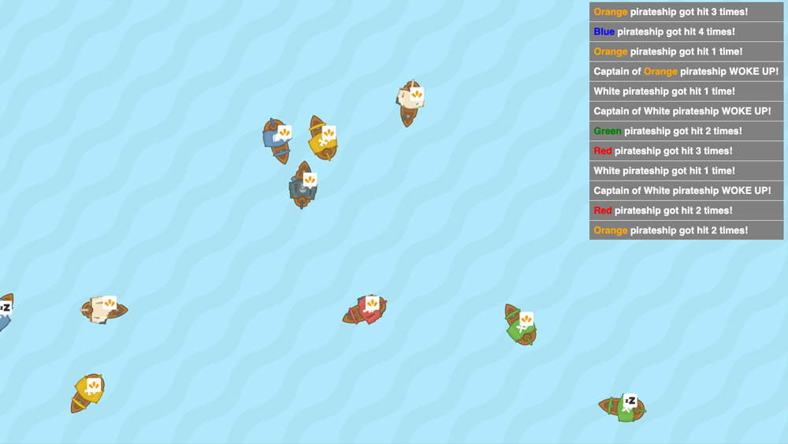

## Games created for school projects
These assignments are made for students as exercises. With these exercises student learn the more advanced principals of OOP like Abstract classes, Interfaces and Design Patterns. 

All exercises are made with Typescript and Html Elements. 

| **Close Call**  |   |
|:-:|:-|
|  | *Topic*   **Polymorphism**    *Goal*  Make sure all cars stop right in front od the stones    *Code*  [Github](https://github.com/HR-CMGT/PRG08-close-call-completed) |
| **Jibby**  |   |
|  | *Topic*   **Strategy Pattern**    *Goal*  Jibby is a tamagotchi you have to keep alive and satisfied    *Code*  [Github](https://github.com/HR-CMGT/PRG08-Jibby-completed) |
| **Angry Captain**  |   |
|  | *Topic*   **Singleton Pattern**    *Goal*  In this simulation the captain wakes up when the boat collides   *Code*  [Github](https://github.com/HR-CMGT/PRG08-Angry-Captain-completed) |
| **Notify the Captain**  |   |
|  | *Topic*   **Observer Pattern**    *Goal*  Wake up the captain to make him listen to the fog horn   *Code*  [Github](https://github.com/HR-CMGT/PRG08-Notify-the-Captain-completed) |
