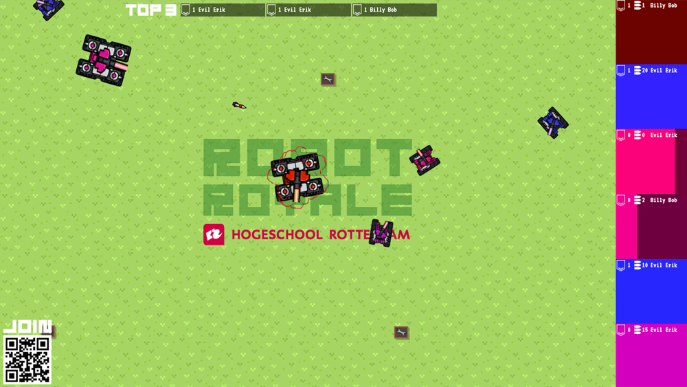
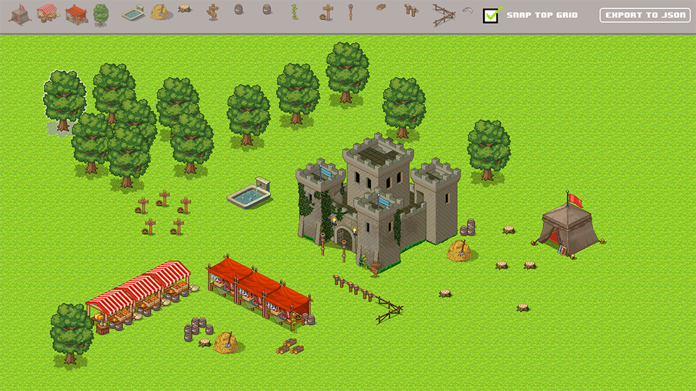
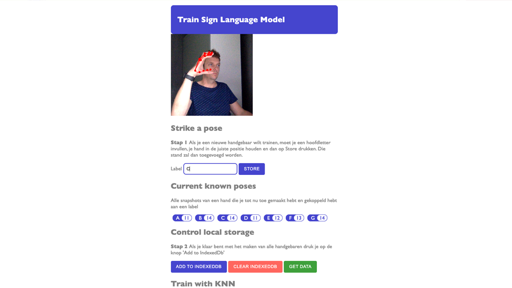
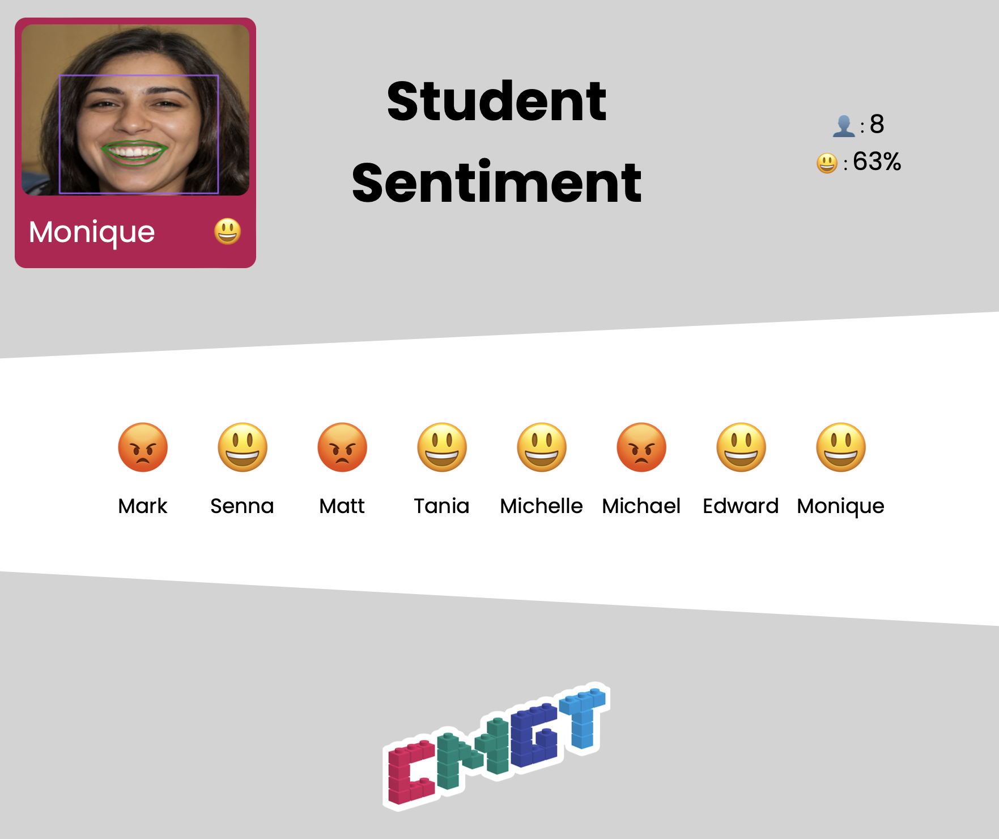
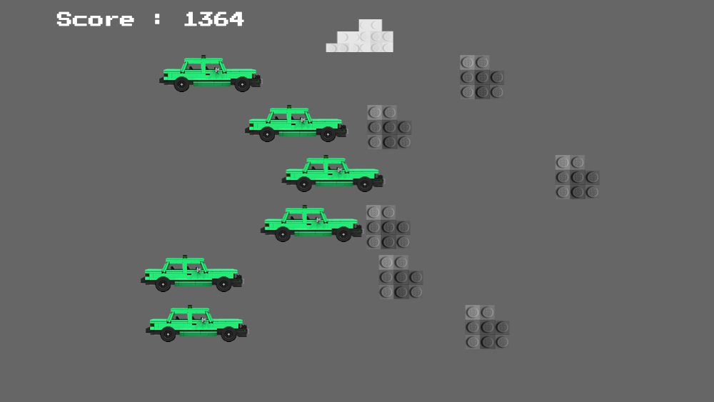
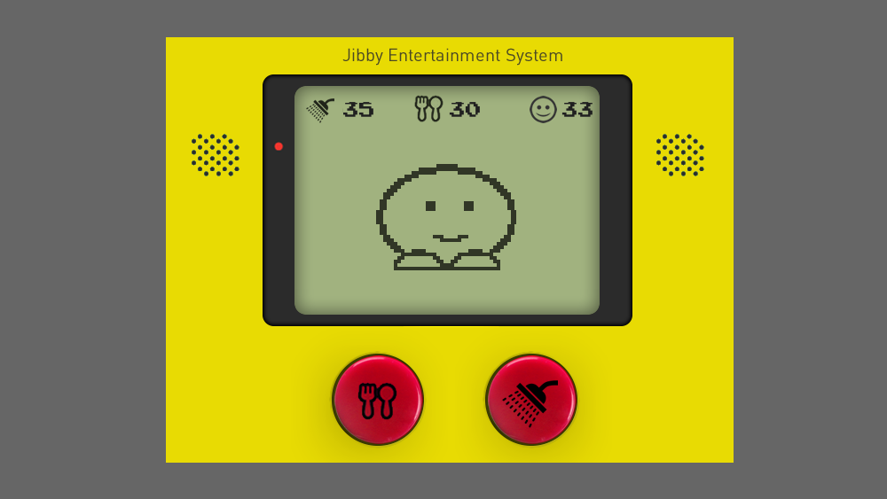
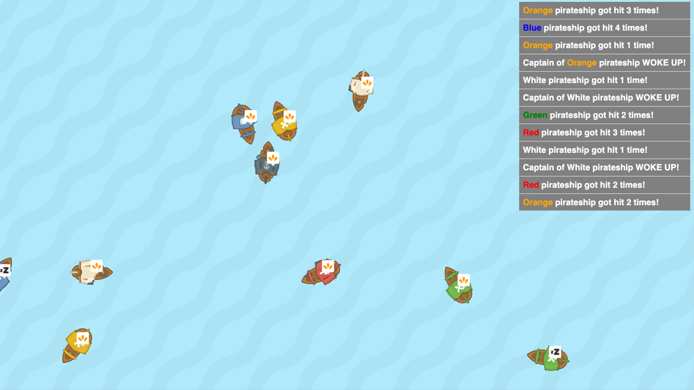

# Bob Pikaar

## Projects

| Robot Royale  |  Level editor |
|:-:|:-:|
|  [Play the game](https://programmeren9.cmgt.hr.nl:8080/viewer/)   [code on GitHub](https://github.com/HR-CMGT/robot-royale) |  [Try the editor](https://bpikaar.github.io/level-editor/)   [code on GitHub](https://github.com/bpikaar/level-editor) |
| **Sign Language Quiz**  | **Ruimtegruis** |
|  [Train the model](https://bpikaar.github.io/sign-language-quiz/learn/)   [Play the quiz](https://bpikaar.github.io/sign-language-quiz/)   [code on GitHub](https://github.com/bpikaar/sign-language-quiz/) |  [Play the game](https://bpikaar.github.io/ruimtegruis/)   [code on GitHub](https://github.com/bpikaar/ruimtegruis/)   &nbsp;
| **Senti-Meter**  |  |
|  [Demo](https://sandbox.cmgt.hr.nl)   [code on GitHub](https://github.com/bpikaar/senti-meter) |  |

## Games created for school projects
These assignments are made for students as exercises. Through these exercises students learn the more advanced principals of OOP like Abstract classes, Interfaces and Design Patterns. 

All exercises are made with Typescript and Html Elements. 

| **Close Call**  |   |
|:-:|:-|
|  | *Topic*   **Polymorphism**    *Goal*  Make sure all cars stop right in front od the stones    *Code*  [Github](https://github.com/HR-CMGT/PRG08-close-call-completed) |
| **Jibby**  |   |
|  | *Topic*   **Strategy Pattern**    *Goal*  Jibby is a tamagotchi you have to keep alive and satisfied    *Code*  [Github](https://github.com/HR-CMGT/PRG08-Jibby-completed) |
| **Angry Captain**  |   |
|  | *Topic*   **Singleton Pattern**    *Goal*  In this simulation the captain wakes up when the boat collides   *Code*  [Github](https://github.com/HR-CMGT/PRG08-Angry-Captain-completed) |
| **Notify the Captain**  |   |
|  | *Topic*   **Observer Pattern**    *Goal*  Wake up the captain to make him listen to the fog horn   *Code*  [Github](https://github.com/HR-CMGT/PRG08-Notify-the-Captain-completed) |
