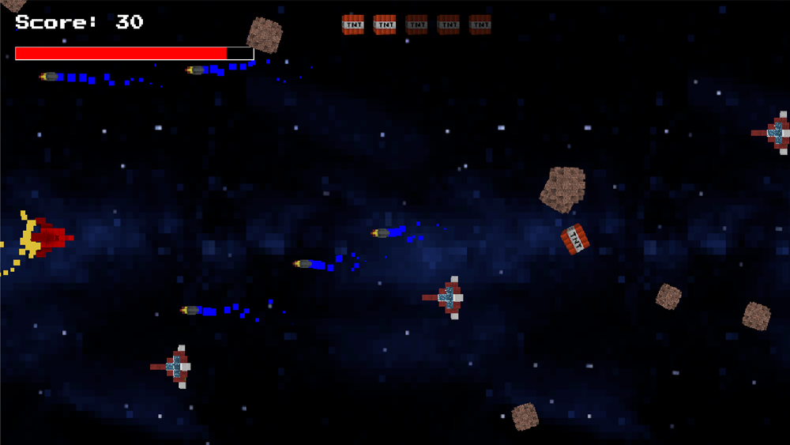

# Bob Pikaar

## Projects

| Robot Royale  |  Level editor |
|:-:|:-:|
|  [Play the game](http://145.24.222.232:8080/viewer/)   [code on GitHub](https://github.com/HR-CMGT/robot-royale) |  [Try the editor](https://bpikaar.github.io/level-editor/)   [code on GitHub](https://github.com/bpikaar/level-editor) |
| **Sign Language Quiz**  | **Ruimtegruis** |
|  [Train the model](https://bpikaar.github.io/sign-language-quiz/learn/)   [Play the quiz](https://bpikaar.github.io/sign-language-quiz/)   [code on GitHub](https://github.com/bpikaar/sign-language-quiz/) |  [Play the game](https://bpikaar.github.io/ruimtegruis/)   [code on GitHub](https://github.com/bpikaar/ruimtegruis/)   &nbsp;
| **Games**  |  |
|  | To learn more about OOP principles, I made these [games](./games.md) for students to practise. |

